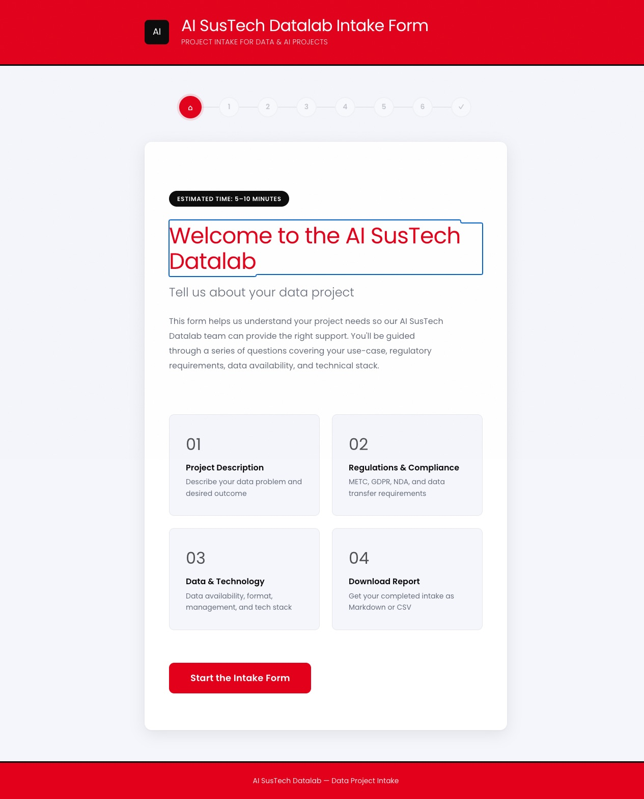
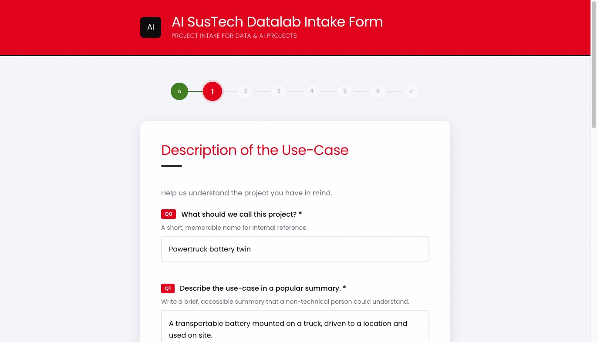

# AI SusTech Datalab Intake Form

**[https://hr-datalab-ai-sustech.github.io/datalab-pages-intakeform/](https://hr-datalab-ai-sustech.github.io/datalab-pages-intakeform/)**

A config-driven, multi-step intake form for the AI SusTech Datalab. Collects data & AI project requests through a guided questionnaire and exports the results as Markdown or CSV.

**The form itself is still static HTML/CSS/JS on GitHub Pages** — no build step, no framework, and
filling it in and downloading your answers sends nothing anywhere.

Since 2026-08-27 there is *also* a backend, [`bridge/`](bridge/README.md), which stores a submission
in Postgres and files it into a review queue in Compass. **Since 2026-08-28 Submit is ON**
(`SUBMIT_ENABLED` in [`src/js/config/bridgeConfig.js`](src/js/config/bridgeConfig.js)): the form still
downloads Markdown/CSV exactly as before, and now also offers a passphrase-gated Submit.

🔺 **The endpoint is public, and `/mcp` deliberately is not.** Enabling Submit meant publishing
`intake.twinhub.nl` to the internet rather than the mesh — otherwise a visitor's browser could never
reach it. The bridge therefore runs **two listeners**: the mesh one serves every route, and the
published one serves the browser REST routes and refuses `/mcp`, which carries an unauthenticated
`submit_intake` and an unfiltered `list_recent_intakes`. Details and the checks that prove it:
[`bridge/README.md`](bridge/README.md).





## Quick Start

### GitHub Pages (production)

Pushes to `main` automatically deploy via GitHub Actions. The site is live at:
https://hr-datalab-ai-sustech.github.io/datalab-pages-intakeform/

### Using Docker (local development)

```bash
docker compose --profile dev up --build
```

Open [http://localhost:8080](http://localhost:8080) in your browser.

ℹ️ **`--profile dev` is required.** Without it Compose starts only the `bridge` service, because
the nginx preview and the bridge's throwaway Postgres are both dev-only — see
[`bridge/README.md`](bridge/README.md). Plain `docker compose up -d` is what the deploy reconciler
runs on the host, and it must not start a second copy of this page there.

To stop:

```bash
docker compose down
```

### Without Docker

Serve the `src/` directory with any static file server:

```bash
npx serve src -l 8080
```

## How It Works

1. A **landing page** introduces the form with an overview of the sections and estimated time
2. The user navigates through 6 question pages covering use-case, regulations, data, and tech stack
3. The **summary page** shows all answers with "Edit" links to jump back to any section
4. Download the completed intake as **Markdown** or **CSV** — the filename carries the project name
5. Optionally **Submit** it to the lab's own backend — on since 2026-08-28, gated by a shared
   passphrase (`SUBMIT_ENABLED` in `src/js/config/bridgeConfig.js`; set it to `false` and the page
   says so plainly instead of showing a button that cannot work)
6. A **Start Over** button clears all answers to begin fresh
7. Form state is persisted in `sessionStorage` — refreshing the page won't lose data
8. Browser **back/forward buttons** work — each page gets a readable URL hash (e.g. `#use-case-description`)

## Download Formats

### Markdown

The downloaded file (`intake-<project>-YYYY-MM-DD.md`) is a structured document:

```markdown
# AI SusTech Datalab Intake Form

> Project intake for data & AI projects

**Generated:** 2026-03-31

---

## 1. Description of the Use-Case

*Help us understand the project you have in mind.*

### Q1: Describe the use-case in a popular summary.

*Write a brief, accessible summary that a non-technical person could understand.*

We want to predict patient readmission rates using historical hospital data
to improve discharge planning and reduce unnecessary readmissions.

---

## 2. Management and Regulations

### Q5: Is there Medical Ethics Review Committee (METC) approval?

Yes

---
...
```

### CSV

The CSV export produces a spreadsheet-friendly file with columns:

| Section | Question ID | Question | Answer |
|---|---|---|---|
| Description of the Use-Case | Q1 | Describe the use-case... | We want to predict... |
| Management and Regulations | Q5 | Is there METC approval? | Yes |

CSV fields are escaped to prevent Excel formula injection.

### Filename

```
{prefix}-{project}-YYYY-MM-DD.md
{prefix}-{project}-YYYY-MM-DD.csv
```

`{prefix}` is `downloadFilenamePrefix` in `formConfig.json`. `{project}` is a slug of **`q0`**
("What should we call this project?") — accents transliterate, punctuation collapses to hyphens, and
a long name is truncated so the date stays visible. If `q0` is empty the project part is omitted
rather than failing.

Example: `intake-powertruck-battery-twin-2026-08-27.md`

🔺 **The project name is in the filename on purpose.** Without it every intake filled in on the same
day downloaded under an identical name — collisions in the Downloads folder, and nothing to say
which project a file belonged to without opening it.

## Configuring the Form

All form content lives in a single JSON file:

```
src/config/formConfig.json
```

Edit this file to add, remove, or change questions. No other file needs to change. Since it's plain JSON (not JavaScript), non-developers can safely edit it too.

### Config Structure

```json
{
  "title": "AI SusTech Datalab Intake Form",
  "subtitle": "Project intake for data & AI projects",
  "downloadFilenamePrefix": "intake",
  "nextButtonText": "Next",
  "prevButtonText": "Previous",

  "pages": [
    {
      "id": "landing",
      "isLanding": true,
      "title": "Welcome to the AI SusTech Datalab",
      "subtitle": "Tell us about your data project",
      "description": "This form helps us understand your project needs...",
      "features": [
        { "icon": "01", "title": "Project Description", "text": "Describe your problem" }
      ],
      "startButtonText": "Start the Intake Form",
      "estimatedTime": "5–10 minutes",
      "fields": []
    },
    {
      "id": "my-page",
      "title": "Page Heading",
      "subtitle": "Optional description text",
      "fields": [ ]
    },
    {
      "id": "summary",
      "title": "Summary & Download",
      "isSummary": true,
      "summaryPageTitle": "Review Your Answers",
      "editButtonText": "Edit",
      "emptyFieldText": "No answer provided",
      "downloadInstructions": "Review your answers above, then download...",
      "downloadButtonText": "Download as Markdown",
      "startOverButtonText": "Start Over",
      "fields": []
    }
  ]
}
```

### Page Types

| Type | Property | Description |
|---|---|---|
| **Landing** | `"isLanding": true` | Welcome page with description, feature cards, and CTA button. Must be the first page. |
| **Form** | (default) | Question page with fields. Requires validation before advancing. |
| **Summary** | `"isSummary": true` | Read-only review, the download buttons, the submit section, and Start Over. Must be the last page. |

### Field Types

#### `textarea` — Multi-line text input

```json
{
  "id": "background",
  "type": "textarea",
  "label": "What is the background of the problem?",
  "subtitle": "Describe the context and why this matters.",
  "placeholder": "Enter your answer...",
  "required": true,
  "rows": 5
}
```

#### `text` — Single-line text input

```json
{
  "id": "file-format",
  "type": "text",
  "label": "What is the file format?",
  "subtitle": "Specify file extensions you expect.",
  "placeholder": "e.g. .csv, .wav, .json",
  "required": true
}
```

#### `radio` — Single-select (pick one)

```json
{
  "id": "data-collected",
  "type": "radio",
  "label": "Is the data already collected?",
  "options": ["Yes, already collected", "No, still needs to be collected"],
  "required": true
}
```

#### `checkbox` — Multi-select (pick many)

```json
{
  "id": "stack-elements",
  "type": "checkbox",
  "label": "Which stack elements are needed?",
  "subtitle": "Select all that apply.",
  "options": ["Data collection", "Cleaning", "Analysis", "Visualization", "ML/AI", "Deployment"],
  "required": true
}
```

#### `select` — Dropdown menu

```json
{
  "id": "priority",
  "type": "select",
  "label": "What is the project priority?",
  "placeholder": "Choose a priority...",
  "options": ["Low", "Medium", "High", "Critical"],
  "required": true
}
```

### Optional Field Properties

| Property | Applies to | Description |
|---|---|---|
| `subtitle` | All types | Help text shown below the question label |
| `placeholder` | text, textarea, select | Placeholder text inside the input |
| `required` | All types | If `true`, the user must answer before advancing |
| `rows` | textarea | Number of visible rows (default: 4) |
| `infoLink` | All types | External reference link `{ "url": "...", "text": "..." }` |

### Landing Page Features

The landing page `features` array renders as cards in a 2x2 grid:

```json
"features": [
  { "icon": "01", "title": "Project Description", "text": "Describe your data problem" },
  { "icon": "02", "title": "Regulations", "text": "METC, GDPR, NDA requirements" }
]
```

### Examples

#### Adding a new page

Add a new object to the `pages` array (between form pages and the summary page):

```json
{
  "id": "team-info",
  "title": "Team Information",
  "subtitle": "Tell us about the people involved.",
  "fields": [
    {
      "id": "q13",
      "type": "text",
      "label": "Who is the project lead?",
      "placeholder": "Full name",
      "required": true
    },
    {
      "id": "q14",
      "type": "select",
      "label": "Which department?",
      "options": ["Research", "Engineering", "Clinical", "Operations", "Other"],
      "required": true
    }
  ]
}
```

#### Making a field optional

Simply omit `required` or set it to `false`:

```json
{
  "id": "notes",
  "type": "textarea",
  "label": "Any additional notes?",
  "subtitle": "Optional — add anything else we should know.",
  "rows": 4
}
```

## Development

### Prerequisites

- **Node.js** >= 18 (for linting tools)
- **Docker** (for local serving)

### Install dependencies

```bash
npm install
```

### Linting

```bash
npm run lint        # Run all linters (ESLint + Stylelint + HTMLHint)
npm run lint:js     # ESLint only
npm run lint:css    # Stylelint only
npm run lint:html   # HTMLHint only
npm run format      # Auto-format with Prettier
```

### NPM Scripts

| Script | Description |
|---|---|
| `npm run lint` | Run all linters |
| `npm run format` | Auto-format all source files |
| `npm run docker:up` | Start the Docker container |
| `npm run docker:down` | Stop the Docker container |

## Project Structure

```
src/
  index.html                        # Single-page HTML shell
  config/
    formConfig.json                  # All form content as JSON (edit this!)
  assets/
    favicon.svg                     # SVG favicon (HR-red rounded mark, white check)
    fonts/                          # Self-hosted Poppins woff2 files (privacy-safe)
  css/
    fonts.css                       # @font-face declarations for Poppins
    reset.css                       # CSS reset
    variables.css                   # Design tokens (colors, fonts, spacing)
    layout.css                      # Page structure (header, main, footer)
    form.css                        # Form elements (inputs, radios, checkboxes, selects)
    navigation.css                  # Step indicator and nav buttons
    landing.css                     # Landing/welcome page
    summary.css                     # Summary/review page and download section
    utilities.css                   # Helpers (hidden, sr-only, reduced-motion)
  js/
    main.js                         # Entry point — loads config, wires DOM
    config/
      formConfig.js                 # Fetches and exposes the JSON config
      bridgeConfig.js               # Bridge URL + SUBMIT_ENABLED flag (the one place to edit)
    modules/
      formRenderer.js               # Reads config, builds DOM for each page
      landingRenderer.js            # Landing page with hero, features, CTA
      navigation.js                 # Page switching, step indicator, history API
      validation.js                 # Per-page required field checks
      stateManager.js               # In-memory + sessionStorage answer store
      markdownGenerator.js          # Converts answers to formatted Markdown
      csvGenerator.js               # Converts answers to CSV with formula protection
      downloadHandler.js            # Creates Blob and triggers file download
      summaryRenderer.js            # Review page: download, submit, start over
      pageController.js             # Decoupled page navigation (avoids circular deps)
bridge/                             # ── The optional backend. Deployed separately, NOT by Pages ──
  server.js                         # REST (/draft, /submit) + MCP over HTTP (/mcp)
  schema.sql                        # The `intakes` table; applied by hand
  mcp-conformance.mjs               # Read-only MCP probe; safe against production
  Dockerfile                        # Multi-stage, digest-pinned
  package.json                      # `pg` is the one dependency
  .env.example                      # Schema only, no values
  README.md                         # How to run it, its traps, its invariants
.github/
  workflows/
    deploy-pages.yml                # Auto-deploy to GitHub Pages on push to main
docker/
  Dockerfile                        # nginx:alpine — the dev preview image
  nginx.conf                        # Static file serving config
docker-compose.yml                  # `bridge` (default) + `web`/`postgres-dev` (profile: dev)
smoke_reconcile.sh                  # Post-deploy health check, run by lab-reconcile
.sops.yaml                          # Encryption recipients (public keys — no secret)
env.sops                            # The bridge's .env, encrypted to the host key set
```

⚠️ **Two deploy paths, one repo.** `src/` is published by GitHub Pages on every push to `main`.
`bridge/` is a container on a lab host, converged by a separate pull-based reconciler — **pushing
here does not deploy it**. That split is also why CSS and JS can briefly be out of step with each
other; [`CLAUDE.md`](CLAUDE.md) explains what that means for anyone restyling a component.

## Architecture Decisions

- **Config-driven rendering** — All questions, options, labels, and UI text live in `formConfig.json`. The renderer reads this config and builds the DOM dynamically. Adding a question means editing one file.
- **No build step** — Uses native ES modules (`<script type="module">`). No bundler, no transpiler.
- **No database *in the page*** — form state lives in `sessionStorage` (survives a refresh, cleared when the tab closes), and the download is always a complete deliverable on its own. ⚠️ This bullet used to read "No database" flatly; that stopped being the whole truth when [`bridge/`](bridge/README.md) was added. The *form* still stores nothing server-side, but pressing **Submit** — when it is enabled — posts the answers to that backend. The download-only path never does.
- **Browser history** — Each page pushes a readable hash to the URL (e.g. `#use-case-description`). Back/forward buttons work. Direct links to specific pages work.
- **Step validation** — Users can only navigate to pages they've already visited via the step indicator. The Next button validates required fields before advancing.
- **CSS custom properties** — All colors, fonts, and spacing are defined as variables in `variables.css`. Rebranding requires editing only that file.
- **Self-hosted fonts** — Poppins (the HR corporate font) is served from `src/assets/fonts/`. No external requests to Google Fonts or other CDNs.
- **Accessibility** — ARIA labels, `aria-describedby` on error fields, visually-hidden fieldset legends, `prefers-reduced-motion` support, keyboard-navigable step indicator.
- **CI/CD** — GitHub Actions workflow auto-deploys to GitHub Pages on every push to `main`.

## Theming

**All colour lives in `src/css/variables.css`.** Reference the tokens from component CSS, never a
hex — that is what keeps a re-skin to one file.

```css
:root {
  --color-primary: #e2001a;       /* HR red — header, primary buttons, active steps */
  --color-secondary: #0a0a0a;     /* Near-black — accent bars, info links */
  --color-error: #dc2828;         /* A DIFFERENT red — see the note below */
  --color-success: #3f7d20;       /* Completed steps */
  --color-bg: #f4f6fb;            /* Page background */
  --color-surface: #fff;          /* Card / form background */
  --font-display: 'Poppins', system-ui, sans-serif;
  --font-body: 'Poppins', system-ui, sans-serif;
}
```

🔺 **Red is the brand, so red cannot also mean danger.** `--color-error` is deliberately a different
red from `--color-primary`: once the primary button is red, hue alone no longer separates "submit"
from "something went wrong". Keep them distinct, and never let colour be the only carrier of meaning.

### `--on-brand-*` — the tokens for surfaces where red is the *background*

Same file, and worth reading before styling anything that sits on the red panel. HR red is an
unforgiving background, measured:

| on `#e2001a` | ratio | |
| --- | --- | --- |
| white | 4.94 | ✅ AA |
| `#fff5f6` | 4.62 | ✅ |
| `#f3f4f6` — a near-white **grey** | 4.49 | ❌ |
| `#ffe8ea` — a soft pink | 4.23 | ❌ large text only |

⇒ **There is no "muted" text on a red surface.** Hierarchy there comes from size and weight. Reaching
for a soft tint to de-emphasise something is the obvious move and it fails AA.

⚠️ **`--on-brand-scrim` is a black wash, not a white one.** Hover must *darken* a red surface: +18%
black lands on `#b90015` where white text measures 6.83, while +15% white lands on `#e6263c` where it
drops to **4.46 and fails**. Lightening a mid-luminance brand colour under white text is the trap
that once made a button look disabled.
